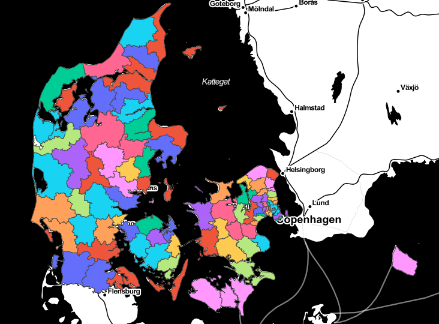
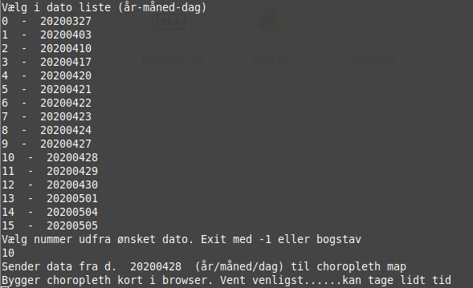
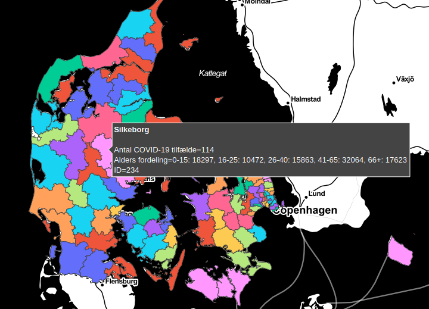

# python Semester Project

  

Gruppe: unusual ear  
Dennis Hansen, CPH-DH153  
Johan Christian Ryge, CPH-JR221  
Martin Bøgh Sander-Thomsen, CPH-MS782  

### Intro
Python program til at hente info om Covid-19 smitte hentet fra Statens Serum Institut og
generel info om kommuner fra Dansk Statistik.  
Data vises enten som pandas dataframes i konsollen eller som et plotly choropleth map i browseren. I denne kan man pege på kommuner og se data.

#### nødvendige moduler  
pip install requests  
pip install pandas  
pip install pdfplumber  
pip install plotly  
pip install bs4  

se evt. også tabula-py længere nede

### For at starte

Eksempel:  

    python start.py         # Viser choropleth map i browser  
    python start.py -m      # Som ovenstående men med multicore (OBS virker ikke pt på windows)
    python start.py -v      # Viser al tekst  
    python start.py -v -m   # Valg muligheder kan kombineres

Valg muligheder :

    -h or --help --name: denne hjælpe tekst
    -m or --multi: Benyt multi-core til at konvertere. OBS! Virker ikke på Windows. Standard er single
    -t or --tabula: Benyt tabula-py til at skanne pdf filer med. Standard er pdfplumber
    -v or --verbose: Alt bliver printet ud (også pandas)
    -p or --pandas: Print pandas i en terminal. Standard output er choropleth kort i browseren
    --no-cache: Download alt igen. OBS! Ikke implementeret. Slet i stedet manuelt alt i folderen ./data/download

### Vælg dato

### Hold musen over kommune

##### Python projekt oplæg

 - Vi vil lave et program der giver et overblik over smittede tilfælde med Covid-19, ved hjælp af et interaktivt kort over Danmark, det kunne være fordelt på kommuner.
 - Vi håber at kunne lave det sådan, at man kan få vist en graf over den statistiske udvikling af smittede tilfælde i kommunerne.
 - Derudover kunne det være spændende at indsamle andre data omkring kommunerne og ved hjælp af webscraping få det til at passe med kortet, så det bliver vist på en pæn måde.

##### Teknologier:
Data collection
  - API
  - Webscrapping
  - Dataset
  - PDF
  - CSV
  - JSON
  - user input - CLI args
  - multithreaded/multicore
  - pandas
  - generators
  - requests

Data wrangling
  - Remove columns/rows
  - Inserting new columns  
  - Regex
  - Aggregation
  - Filtering

Presentation
  - plotly choropleth map i browser
  - pandas dataframes i konsol

##### Største udfordringer
  - choropleth map med store dataframes og geojson-filer. Choropleth maps er ikke bugfrit.
  - PDF konvertering til pandas dataframes. PDF konvertering er 100%
  - Webscraping. Ikke entydige html tags at gå efter.
  - Aggregation af Dansk Statistik data fra dataframe til een tekststreng per kommune

##### tabula-py ---- OBS ikke nødvendig mere pga. at pdfplumber virker godt ....
Alternativt (tabula-py) Behøves kun hvis man vælger option -t:  
pip install --no-cache-dir tabula-py  

#### For tabula-py windows 10 brugere  
Tabula-py er desværre ikke så let at installere, så pdfplumber er benyttet i stedet for. Hvis man har lyst, og har problemer på windows, så er her en instruktion:

 * If you don’t have it already, install Java
 * Try to run example code (replace the appropriate PDF file name).
 * If there’s a FileNotFoundError when it calls read_pdf(), and when you type java on command line it says 'java' is not recognized as an internal or external command, operable program or batch file, you should set PATH environment variable to point to the Java directory.
 * Find the main Java folder like jre... or jdk.... On Windows 10 it was under C:\Program Files\Java
 * On Windows 10: Control Panel -> System and Security -> System -> Advanced System Settings -> Environment Variables -> Select PATH –> Edit
 * Add the bin folder like C:\Program Files\Java\jre1.8.0_144\bin, hit OK a bunch of times.
 * On command line, java should now print a list of options, and tabula.read_pdf() should run.

##### Eksempel tabula - test.pdf skal være en gyldig pdf fil i samme folder
    import tabula

    tabula.convert_into("test.pdf", "output.csv", output_format="csv", pages='all')
